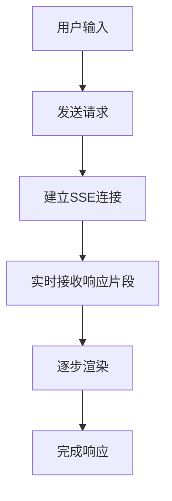
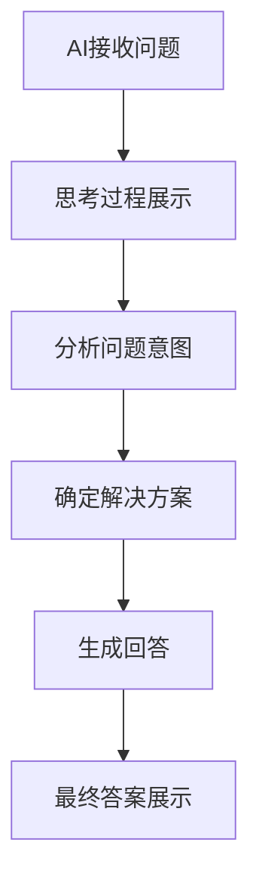
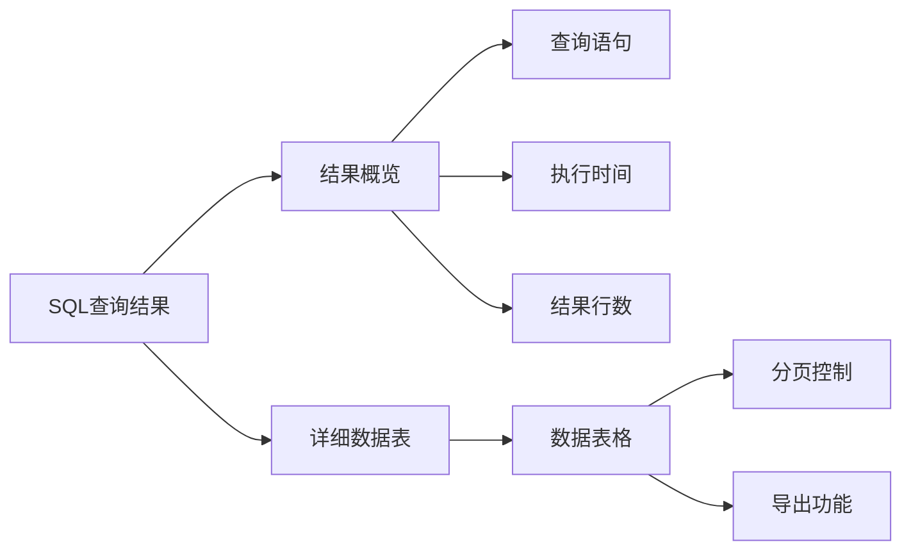

# AI对话样式优化设计文档

<!--
注意：这是一个设计文档，不应包含任何实际代码实现。
所有内容应以设计规范、架构图、流程图等形式呈现。
-->

## 1. 概述

### 1.1 目标
优化AI对话界面的用户体验，提升交互的直观性和信息传达效率，包括：
- 实现真正的流式对话显示
- 优化思考模式的文本主次显示
- 改进结构化数据的展示方式
- 参考业界最佳实践，提升整体界面美观度和可用性

### 1.2 背景
当前AI助手界面已具备基础的流式对话功能，但在信息展示层次、思考过程可视化和结构化数据呈现方面仍有改进空间。需要参考如ChatGPT等主流AI产品的设计模式，提升用户交互体验。

## 2. 现有架构分析

### 2.1 前端组件
- **AI助手组件** (`ai-assistant.component`)：负责对话界面展示和用户交互
- **查询服务** (`query.service.ts`)：处理与后端的通信，包括流式响应处理
- **样式文件** (`ai-assistant.component.css`)：定义对话界面的视觉呈现

### 2.2 后端服务
- **聊天接口** (`/api/chat`)：支持流式和非流式响应
- **流式处理**：基于Server-Sent Events (SSE)协议实现
- **Ollama集成**：通过本地Ollama服务提供AI能力

### 2.3 当前问题
1. 流式对话显示不够流畅，缺乏加载状态的细节展示
2. 思考过程和最终答案未有效区分展示
3. 结构化数据（如SQL查询结果）展示方式较为简陋
4. 界面交互细节有待优化

## 3. 优化设计方案

### 3.1 流式对话优化

#### 3.1.1 流式响应处理改进

#### 3.1.2 加载状态细化
- **连接建立中**：显示"正在连接AI服务..."
- **模型加载中**：显示"正在加载AI模型..."
- **思考中**：显示"AI正在思考..."并展示思考过程
- **生成中**：实时显示生成的文本内容

### 3.2 思考模式优化

#### 3.2.1 思考过程可视化
采用分层展示模式：

#### 3.2.2 主次内容区分
- **主内容**：最终答案和关键信息，清晰展示
- **次内容**：思考过程和中间步骤，可折叠查看
- **交互方式**：默认折叠思考过程，用户可主动展开

### 3.3 结构化数据展示优化

#### 3.3.1 SQL查询结果展示

结构化数据展示采用表格形式，提供清晰的数据呈现：

#### 3.3.2 多种数据展示模式
- **表格模式**：适用于结构化数据
- **JSON模式**：适用于复杂嵌套数据
- **图表模式**：适用于统计类数据（可选扩展）

### 3.4 界面交互优化

#### 3.4.1 消息气泡设计
- **用户消息**：右侧对齐，蓝色背景
- **AI消息**：左侧对齐，白色背景，带阴影
- **系统消息**：居中显示，灰色背景

#### 3.4.2 操作功能增强
- **复制按钮**：一键复制SQL语句或答案文本
- **收藏功能**：保存有价值的对话内容
- **重新生成**：重新生成AI回答
- **反馈机制**：对回答质量进行评价

## 4. 技术实现方案

### 4.1 前端实现

#### 4.1.1 组件结构调整

消息对象结构优化，支持多种消息类型：

| 属性 | 类型 | 说明 |
|------|------|------|
| id | string | 消息唯一标识 |
| role | 'user' \| 'assistant' \| 'system' | 消息发送者角色 |
| content | string | 消息内容 |
| timestamp | Date | 消息时间戳 |
| type | 'text' \| 'sql' \| 'thinking' \| 'result' | 消息类型 |
| metadata | any | 额外元数据 |
| collapsed | boolean | 折叠状态 |

#### 4.1.2 流式处理优化

改进的流式处理逻辑需要区分思考过程和最终答案：

1. 当接收到`status: 'thinking'`时，更新思考过程显示
2. 当接收到`status: 'result'`时，更新最终结果内容
3. 保持对现有流式响应格式的兼容性

#### 4.1.3 样式优化

消息气泡样式优化：
- 用户消息采用蓝色渐变背景，右侧对齐，圆角设计
- AI消息使用白色背景，左侧对齐，带有阴影效果
- 思考过程使用浅蓝色背景，左侧边框标识，可折叠显示

### 4.2 后端实现

#### 4.2.1 响应格式优化

后端流式响应格式增强：
1. 在思考过程开始时发送`status: 'thinking'`信号
2. 在处理过程中发送中间状态更新
3. 在生成结果时发送`status: 'result'`信号
4. 结束时发送`[DONE]`信号

## 5. 用户体验优化

### 5.1 视觉层次优化
- 使用不同的字体大小、颜色和间距区分主次信息
- 通过卡片式设计和阴影效果增强内容层次感
- 合理运用留白提升界面呼吸感

### 5.2 交互细节优化
- 消息发送时添加动画效果
- 滚动到底部时自动聚焦新消息
- 支持键盘快捷键操作（Enter发送，Shift+Enter换行）

### 5.3 响应式设计
- 适配不同屏幕尺寸的显示效果
- 移动端优化触摸交互体验
- 确保在各种设备上都能良好展示结构化数据

## 6. 测试策略

### 6.1 单元测试
- 测试流式响应处理逻辑
- 验证不同消息类型的渲染
- 确保错误处理机制正常工作

### 6.2 集成测试
- 验证前后端流式通信
- 测试不同AI模型的兼容性
- 确认结构化数据展示功能

### 6.3 用户体验测试
- 收集用户对新界面的反馈
- A/B测试不同设计方案
- 评估优化后的用户满意度

## 7. 部署与监控

### 7.1 部署方案
- 前端组件更新通过Angular构建流程
- 后端服务更新通过Docker镜像更新
- 确保向后兼容性，避免影响现有功能

### 7.2 监控指标
- 流式响应的平均延迟
- 用户交互频率统计
- 错误率和用户反馈收集