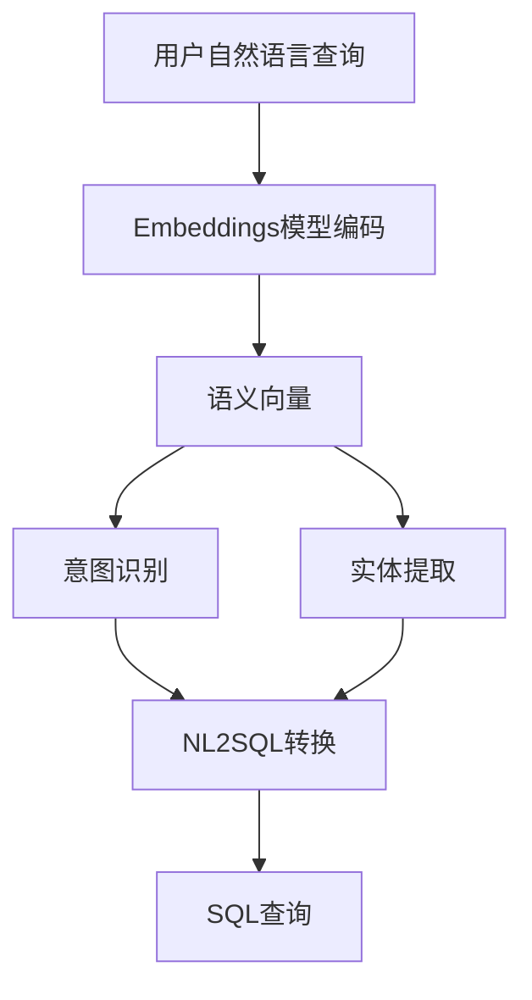
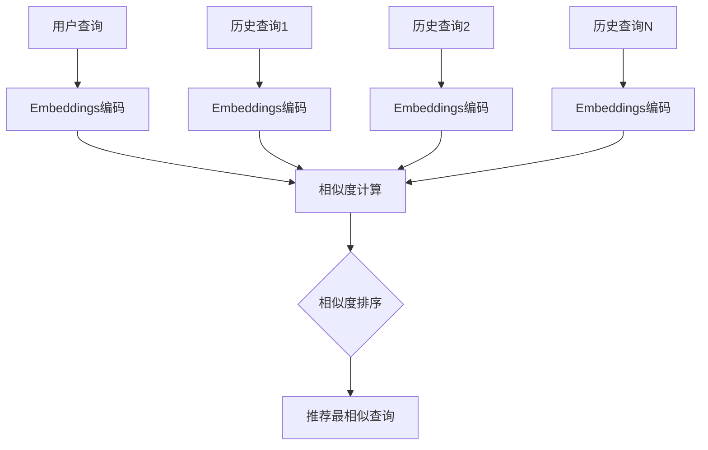
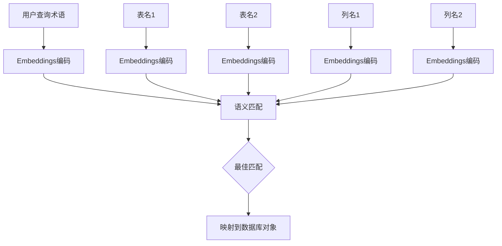
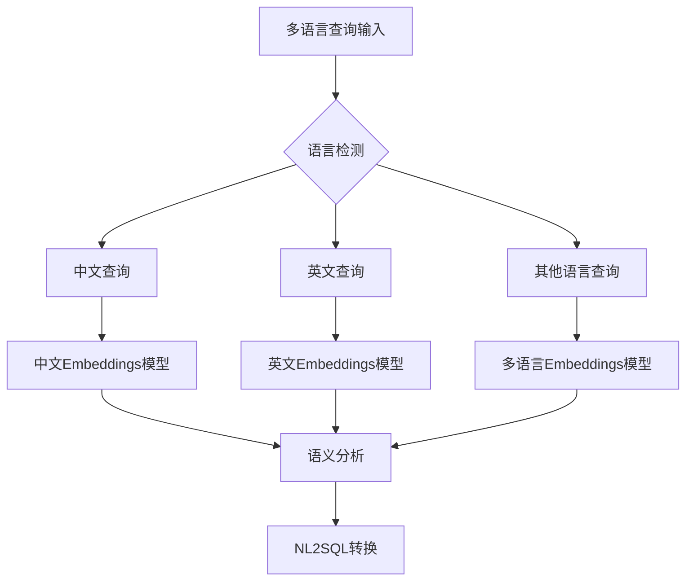
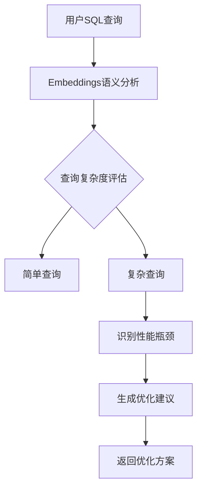
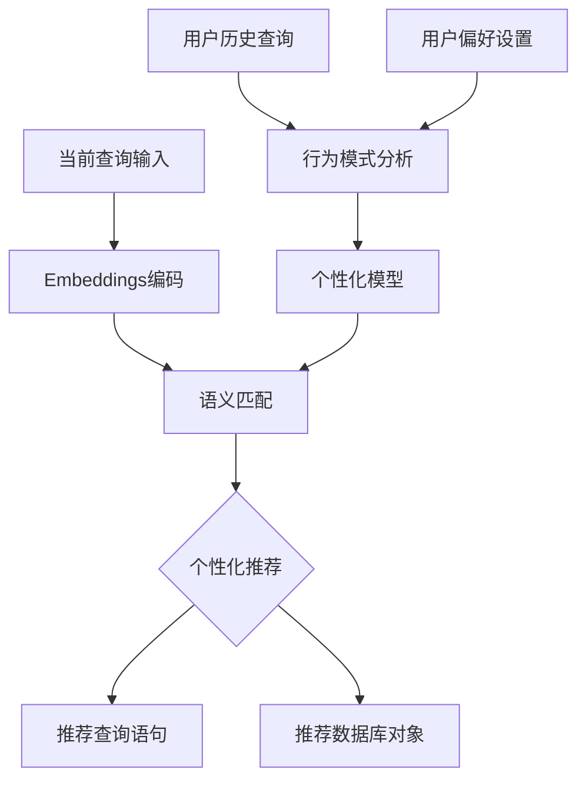

# Embeddings 300m 模型集成建议

## 1. 概述

本设计文档旨在分析如何在当前的 Chat2DB 项目中集成 Embeddings 300m 模型，以提升自然语言到 SQL 查询的转换准确性。当前项目已经具备基础的 NLP 到 SQL 转换功能，但转换逻辑相对简单，主要基于关键词匹配。通过集成 Embeddings 模型，可以提升语义理解能力，从而生成更准确的 SQL 查询。

### 1.1 项目背景

Chat2DB 是一个简化版的数据库查询工具，旨在通过自然语言处理将用户输入的自然语言转换为 SQL 查询，并在数据库上执行。项目采用前后端分离架构，前端使用 Angular，后端使用 Flask 提供 API 服务。

### 1.2 Embeddings 300m 模型简介

Embeddings 300m 是一个轻量级的嵌入模型，具有较小的参数量（300M），适合在资源受限的环境中部署。该模型能够将文本转换为高维向量表示，捕捉文本的语义信息，可用于文本相似度计算、意图识别等任务。

## 2. 当前系统分析

### 2.1 现有功能
- 基于关键词匹配的简单 NL2SQL 转换 (`nlp_enhanced.py`)
- 支持多种数据库连接（SQLite、MySQL、PostgreSQL）
- 提供 RESTful API 接口
- 集成 Ollama 模型支持（通过 `/api/chat` 接口）

### 2.2 NL2SQL 转换现状

当前的 NL2SQL 转换主要依赖关键词匹配，例如：

```python
class EnhancedNLP:
    def __init__(self):
        # 定义关键词映射
        self.select_keywords = ['show', 'list', 'get', 'find', 'retrieve', 'display', 'select']
        self.count_keywords = ['count', 'how many', 'number of', 'total']
        # ...
    
    def parse_nl_to_sql(self, nl_text: str, table_name: str = None) -> str:
        text = nl_text.strip().lower()
        
        # 处理COUNT查询
        if any(keyword in text for keyword in self.count_keywords):
            return self._parse_count_query(text, table_name)
        
        # 处理SELECT查询
        if any(keyword in text for keyword in self.select_keywords):
            return self._parse_select_query(text, table_name)
        # ...
```

这种基于关键词的匹配方式存在以下局限：
1. 无法处理同义词或语义相近的表达
2. 对查询语序敏感
3. 难以理解复杂的查询意图
4. 无法处理用户使用非标准术语的情况

### 2.2 现有模型集成
项目当前已经集成了对 Ollama 模型的支持，包括：
- 通过 `/api/chat` 端点调用大语言模型
- 模型列表获取功能
- 前端模型选择界面

后端通过 `call_ollama` 函数与 Ollama 服务交互：

```python
def call_ollama(prompt, model=None, timeout=30):
    model = model or OLLAMA_MODEL
    # 尝试多个候选端点和载荷格式
    endpoints = [
        '/api/generate',
        '/api/completions',
        '/v1/generate',
        '/v1/completions',
        '/api/chat',
        '/generate'
    ]
    # ...
```

前端通过 `QueryService` 调用后端接口：

```typescript
class QueryService {
  chat(message: string, history: any[] = [], model?: string): Observable<any> {
    const payload: any = { message, history };
    if (model) payload.model = model;
    return this.http.post(`${this.base}/chat`, payload);
  }
}
```

### 2.3 技术栈
- 后端：Python Flask
- 前端：Angular
- 数据库：SQLite（默认），支持 MySQL 和 PostgreSQL
- 依赖管理：requirements.txt（Python）和 package.json（Node.js）

## 3. Embeddings 300m 模型集成方案

### 3.1 集成位置分析

Embeddings 300m 模型可以在以下功能模块中集成：

#### 3.1.1 自然语言理解增强
- **现有模块**：`nlp_enhanced.py` 中的 `parse_nl_to_sql` 方法
- **改进点**：使用 Embeddings 模型提升意图识别和实体提取的准确性
- **预期效果**：更准确地识别用户查询意图，提高 SQL 生成质量



#### 3.1.2 查询语义相似度计算
- **应用场景**：相似查询推荐、查询优化建议
- **实现方式**：计算用户查询与历史查询的语义相似度
- **预期效果**：提供查询建议，减少重复输入



#### 3.1.3 数据库模式理解
- **应用场景**：表名、列名的语义匹配
- **实现方式**：为数据库模式元素生成 Embeddings，与用户查询进行匹配
- **预期效果**：即使用户使用非标准术语，也能正确映射到数据库字段



### 3.2 技术实现方案

#### 方案一：本地模型集成
```
[用户查询] -> [Embeddings模型] -> [语义向量] -> [意图识别/实体提取] -> [NL2SQL转换] -> [SQL执行]
```

优势：
- 低延迟
- 离线可用
- 隐私保护

劣势：
- 需要额外的模型部署和维护
- 内存占用较大

#### 方案二：API服务集成
```
[用户查询] -> [后端服务] -> [外部Embeddings API] -> [语义向量] -> [意图识别/实体提取] -> [NL2SQL转换] -> [SQL执行]
```

优势：
- 无需本地部署模型
- 易于更新模型版本

劣势：
- 依赖网络连接
- 可能有延迟
- 有调用成本

## 4. 具体集成建议

### 4.1 增强 NL2SQL 转换精度

#### 4.1.1 改进意图识别
当前的意图识别主要基于关键词匹配，可以使用 Embeddings 模型提升准确性：

```python
# 当前实现（nlp_enhanced.py）
def parse_nl_to_sql(self, nl_text: str, table_name: str = None) -> str:
    text = nl_text.strip().lower()
    
    # 处理COUNT查询
    if any(keyword in text for keyword in self.count_keywords):
        return self._parse_count_query(text, table_name)
    
    # 处理SELECT查询
    if any(keyword in text for keyword in self.select_keywords):
        return self._parse_select_query(text, table_name)
```

集成 Embeddings 后的改进：

```python
# 改进后的实现
class EnhancedNLP:
    def __init__(self, embeddings_model=None):
        # 初始化 Embeddings 模型
        self.embeddings_model = embeddings_model
        
        # 预先计算各类意图的向量表示
        self.count_intent_embeddings = self._precompute_intent_embeddings(self.count_keywords)
        self.select_intent_embeddings = self._precompute_intent_embeddings(self.select_keywords)
        # ...
        
        # 相似度阈值
        self.threshold = 0.7
    
    def parse_nl_to_sql(self, nl_text: str, table_name: str = None) -> str:
        # 使用 Embeddings 模型计算查询的语义向量
        query_embedding = self.embeddings_model.encode(nl_text)
        
        # 计算与各类操作关键词的相似度
        count_similarity = self._calculate_similarity(query_embedding, self.count_intent_embeddings)
        select_similarity = self._calculate_similarity(query_embedding, self.select_intent_embeddings)
        
        # 根据相似度确定意图
        if count_similarity > select_similarity and count_similarity > self.threshold:
            return self._parse_count_query(nl_text, table_name)
        elif select_similarity > self.threshold:
            return self._parse_select_query(nl_text, table_name)
        else:
            # 默认处理
            return self._parse_select_query(nl_text, table_name)
    
    def _precompute_intent_embeddings(self, keywords):
        """预先计算意图关键词的向量表示"""
        embeddings = []
        for keyword in keywords:
            embedding = self.embeddings_model.encode(keyword)
            embeddings.append(embedding)
        return embeddings
    
    def _calculate_similarity(self, query_embedding, intent_embeddings):
        """计算查询与意图向量的相似度"""
        max_similarity = 0
        for intent_embedding in intent_embeddings:
            similarity = self._cosine_similarity(query_embedding, intent_embedding)
            if similarity > max_similarity:
                max_similarity = similarity
        return max_similarity
```

#### 4.1.2 改进实体提取
使用 Embeddings 模型提升表名和列名识别的准确性：

```python
class EnhancedNLP:
    def __init__(self, embeddings_model=None):
        # 初始化 Embeddings 模型
        self.embeddings_model = embeddings_model
        # 表名相似度阈值
        self.table_similarity_threshold = 0.6
        # 列名相似度阈值
        self.column_similarity_threshold = 0.5
    
    def _extract_table_name(self, text: str, available_tables: List[str]) -> str:
        """使用 Embeddings 模型提取最匹配的表名"""
        # 获取查询文本的语义向量
        query_embedding = self.embeddings_model.encode(text)
        
        # 计算与所有可用表名的相似度
        similarities = []
        for table in available_tables:
            table_embedding = self.embeddings_model.encode(table)
            similarity = self._cosine_similarity(query_embedding, table_embedding)
            similarities.append((table, similarity))
        
        # 返回相似度最高的表名
        if similarities:
            similarities.sort(key=lambda x: x[1], reverse=True)
            if similarities[0][1] > self.table_similarity_threshold:
                return similarities[0][0]
        
        return None
    
    def _extract_columns(self, text: str, table_schema: Dict[str, List[str]]) -> List[str]:
        """使用 Embeddings 模型提取列名"""
        # 获取查询文本的语义向量
        query_embedding = self.embeddings_model.encode(text)
        
        # 收集所有可能的列名
        all_columns = []
        for table, columns in table_schema.items():
            all_columns.extend(columns)
        
        # 计算与所有列名的相似度
        matched_columns = []
        for column in all_columns:
            column_embedding = self.embeddings_model.encode(column)
            similarity = self._cosine_similarity(query_embedding, column_embedding)
            if similarity > self.column_similarity_threshold:
                matched_columns.append((column, similarity))
        
        # 按相似度排序并返回匹配的列名
        matched_columns.sort(key=lambda x: x[1], reverse=True)
        return [column for column, similarity in matched_columns]
```

### 4.2 相似查询推荐功能

#### 4.2.1 功能描述
基于用户历史查询和当前查询的语义相似度，推荐相似的历史查询。

#### 4.2.2 实现方案
1. 为每个用户查询生成 Embeddings 向量并存储
2. 当用户输入新查询时，计算其与历史查询的相似度
3. 返回相似度最高的历史查询作为推荐

### 4.3 数据库模式语义理解

#### 4.3.1 功能描述
使用 Embeddings 模型理解数据库表和列的语义，提升用户查询与数据库模式的匹配度。

#### 4.3.2 实现方案
1. 为数据库中的表名和列名生成 Embeddings 向量
2. 当用户查询中包含某些术语时，通过语义相似度匹配到最接近的表名或列名
3. 提高查询转换的准确性

## 5. 系统架构调整

### 5.1 后端架构调整

#### 新增模块
```
backend/
├── embeddings/
│   ├── __init__.py
│   ├── model.py              # Embeddings 模型加载和调用
│   └── similarity.py         # 相似度计算工具
├── nlp_enhanced.py           # 改进的 NLP 模块
└── app.py                    # 新增的 Embeddings 相关 API
```

#### API 接口扩展
1. `POST /api/embeddings/encode` - 文本编码为向量
2. `POST /api/embeddings/similarity` - 计算两个文本的相似度
3. `GET /api/embeddings/suggestions` - 获取相似查询建议

#### Embeddings 模型集成实现

```python
# embeddings/model.py
from sentence_transformers import SentenceTransformer
import numpy as np

class EmbeddingsModel:
    def __init__(self, model_name='sentence-transformers/paraphrase-multilingual-MiniLM-L12-v2'):
        self.model = SentenceTransformer(model_name)
    
    def encode(self, text):
        """将文本编码为向量"""
        return self.model.encode(text)
    
    def similarity(self, text1, text2):
        """计算两个文本的相似度"""
        embedding1 = self.encode(text1)
        embedding2 = self.encode(text2)
        return np.dot(embedding1, embedding2) / (np.linalg.norm(embedding1) * np.linalg.norm(embedding2))

# app.py 中新增的 API 端点
@app.route('/api/embeddings/encode', methods=['POST'])
def encode_text():
    data = request.get_json()
    if not data or 'text' not in data:
        return jsonify({'error': 'missing text'}), 400
    
    try:
        # 初始化 Embeddings 模型
        embeddings_model = EmbeddingsModel()
        # 编码文本
        embedding = embeddings_model.encode(data['text'])
        return jsonify({'embedding': embedding.tolist()})
    except Exception as e:
        return jsonify({'error': str(e)}), 500

@app.route('/api/embeddings/similarity', methods=['POST'])
def calculate_similarity():
    data = request.get_json()
    if not data or 'text1' not in data or 'text2' not in data:
        return jsonify({'error': 'missing text1 or text2'}), 400
    
    try:
        # 初始化 Embeddings 模型
        embeddings_model = EmbeddingsModel()
        # 计算相似度
        similarity = embeddings_model.similarity(data['text1'], data['text2'])
        return jsonify({'similarity': float(similarity)})
    except Exception as e:
        return jsonify({'error': str(e)}), 500
```

### 5.2 前端架构调整

#### 新增功能
1. 查询建议面板：显示与当前输入相似的历史查询
2. 语义搜索增强：在数据库对象选择时提供语义匹配建议

#### 前端集成实现

```typescript
// query.service.ts
@Injectable({ providedIn: 'root' })
export class QueryService {
  private base = environment.apiBase;
  
  constructor(private http: HttpClient) {}

  query(nl: string): Observable<any> {
    return this.http.post(`${this.base}/query`, { query: nl });
  }

  // call chat with optional model override
  chat(message: string, history: any[] = [], model?: string): Observable<any> {
    const payload: any = { message, history };
    if (model) payload.model = model;
    return this.http.post(`${this.base}/chat`, payload);
  }

  // list available models (proxied by backend)
  getModels(): Observable<any> {
    return this.http.get(`${this.base}/models`);
  }
  
  // 新增 Embeddings 相关方法
  encodeText(text: string): Observable<any> {
    return this.http.post(`${this.base}/embeddings/encode`, { text });
  }
  
  calculateSimilarity(text1: string, text2: string): Observable<any> {
    return this.http.post(`${this.base}/embeddings/similarity`, { text1, text2 });
  }
  
  getSuggestions(query: string): Observable<any> {
    return this.http.post(`${this.base}/embeddings/suggestions`, { query });
  }
}
```

```typescript
// query.component.ts
export class QueryComponent implements OnInit {
  queryText = '';
  results: any[] = [];
  sql = '';
  loading = false;
  
  // 新增建议相关属性
  suggestions: string[] = [];
  showSuggestions = false;

  constructor(private svc: QueryService) {}

  ngOnInit(): void {
    this.fetchModels();
  }
  
  // 获取查询建议
  getSuggestions() {
    if (this.queryText.length > 3) {
      this.svc.getSuggestions(this.queryText).subscribe({
        next: (res) => {
          this.suggestions = res.suggestions || [];
          this.showSuggestions = this.suggestions.length > 0;
        },
        error: (err) => {
          console.error('Failed to get suggestions', err);
        }
      });
    }
  }
  
  // 选择建议
  selectSuggestion(suggestion: string) {
    this.queryText = suggestion;
    this.showSuggestions = false;
    this.send();
  }
}
```

```html
<!-- query.component.html -->
<div class="chat2db">
  <h3>Chat2DB 简易演示</h3>
  
  <!-- Navigation -->
  <div style="margin-bottom: 20px;">
    <button routerLink="/connections" class="btn btn-secondary">数据库连接管理</button>
  </div>
  
  <div class="query-container">
    <textarea 
      rows="3" 
      cols="60" 
      [(ngModel)]="queryText" 
      (input)="getSuggestions()"
      placeholder="请输入您的查询...">
    </textarea>
    
    <!-- 查询建议面板 -->
    <div class="suggestions-panel" *ngIf="showSuggestions">
      <div 
        class="suggestion-item" 
        *ngFor="let suggestion of suggestions" 
        (click)="selectSuggestion(suggestion)">
        {{ suggestion }}
      </div>
    </div>
  </div>
  
  <br>

  <div style="margin-top:8px">
    <label for="model">模型:</label>
    <select id="model" [(ngModel)]="selectedModel">
      <option *ngFor="let m of models" [value]="m">{{m}}</option>
    </select>
    <button (click)="fetchModels()" [disabled]="loadingModels">刷新模型</button>
    <button (click)="loadModelAndChat()" [disabled]="loading || !selectedModel">加载并发送</button>
    <button (click)="send()" [disabled]="loading">发送（SQL）</button>
  </div>
  <div *ngIf="loadingMessage" style="margin-top:8px;color:#b04;">{{loadingMessage}}</div>

  <div *ngIf="sql">
    <h4>执行的 SQL</h4>
    <pre>{{sql}}</pre>
  </div>

  <div *ngIf="results.length">
    <h4>结果（最多 100 条）</h4>
    <table border="1">
      <thead>
        <tr>
          <th *ngFor="let k of (results[0] | keyvalue)">{{k.key}}</th>
        </tr>
      </thead>
      <tbody>
        <tr *ngFor="let r of results">
          <td *ngFor="let v of (r | keyvalue)">{{v.value}}</td>
        </tr>
      </tbody>
    </table>
  </div>
</div>
```

## 6. 部署和配置

### 6.1 本地模型部署
如果选择本地部署 Embeddings 300m 模型，需要：
1. 在 Dockerfile 中添加模型文件下载步骤
2. 更新 requirements.txt 添加相关依赖（如 sentence-transformers）
3. 修改 docker-compose.yml 挂载模型文件卷

#### Dockerfile 修改示例
```dockerfile
# backend/Dockerfile
FROM python:3.9-slim

WORKDIR /app

COPY requirements.txt .
RUN pip install -r requirements.txt

# 下载 Embeddings 模型
RUN python -c "from sentence_transformers import SentenceTransformer; SentenceTransformer('sentence-transformers/paraphrase-multilingual-MiniLM-L12-v2')"

COPY . .

EXPOSE 5001

CMD ["python", "app.py"]
```

#### requirements.txt 更新
```txt
# backend/requirements.txt
Flask>=2.2.0
flask-cors>=3.0.10
pandas>=2.0
sqlalchemy>=1.4
requests>=2.0
pymysql>=1.0.2
psycopg2-binary>=2.9.0
PyJWT>=2.4.0
sentence-transformers>=2.2.0  # 新增 Embeddings 模型依赖
numpy>=1.21.0
```

#### docker-compose.yml 修改
```yaml
version: '3.8'
services:
  backend:
    build:
      context: ./backend
      dockerfile: Dockerfile
    container_name: chat2db_backend
    volumes:
      - ./backend:/app
      - ./data:/data
      - ./models:/models  # 挂载模型文件卷
    ports:
      - "5001:5001"
    environment:
      - FLASK_ENV=development
      - OLLAMA_URL=http://host.docker.internal:11434
      - OLLAMA_MODEL=llama2
    extra_hosts:
      - "host.docker.internal:host-gateway"
    networks:
      - chat2db_net
```

### 6.2 云端 API 集成
如果选择使用云端 Embeddings API：
1. 在配置文件中添加 API 密钥和端点配置
2. 实现 API 调用客户端
3. 添加错误处理和重试机制

#### 云端 API 调用实现示例
```python
# embeddings/model.py
import requests
import numpy as np

class CloudEmbeddingsModel:
    def __init__(self, api_key, api_endpoint):
        self.api_key = api_key
        self.api_endpoint = api_endpoint
        self.headers = {
            'Authorization': f'Bearer {api_key}',
            'Content-Type': 'application/json'
        }
    
    def encode(self, text):
        """通过云端 API 将文本编码为向量"""
        payload = {
            'text': text
        }
        response = requests.post(
            f'{self.api_endpoint}/embeddings',
            headers=self.headers,
            json=payload,
            timeout=30
        )
        response.raise_for_status()
        return np.array(response.json()['embedding'])
    
    def similarity(self, text1, text2):
        """计算两个文本的相似度"""
        embedding1 = self.encode(text1)
        embedding2 = self.encode(text2)
        return np.dot(embedding1, embedding2) / (np.linalg.norm(embedding1) * np.linalg.norm(embedding2))
```

#### 环境变量配置
```yaml
# docker-compose.yml
version: '3.8'
services:
  backend:
    # ...
    environment:
      - FLASK_ENV=development
      - OLLAMA_URL=http://host.docker.internal:11434
      - OLLAMA_MODEL=llama2
      - EMBEDDINGS_API_KEY=your_api_key_here
      - EMBEDDINGS_API_ENDPOINT=https://api.example.com/v1
    # ...
```

## 7. 性能和安全考虑

### 7.1 性能优化
1. 向量缓存：对常用查询和数据库模式元素的向量进行缓存
2. 批量处理：支持批量向量计算以提高效率
3. 异步处理：对于非实时性要求不高的功能，采用异步处理

### 7.2 安全考虑
1. API 密钥保护：如果使用云端服务，需要安全地管理 API 密钥
2. 数据隐私：确保用户查询数据不会被不当使用
3. 输入验证：防止恶意输入导致模型服务异常

## 8. 测试策略

### 8.1 单元测试
1. Embeddings 模型调用测试
2. 相似度计算准确性测试
3. 查询意图识别准确性测试

#### 单元测试示例
```python
# tests/test_embeddings.py
import unittest
from backend.embeddings.model import EmbeddingsModel

class TestEmbeddingsModel(unittest.TestCase):
    def setUp(self):
        self.model = EmbeddingsModel()
    
    def test_encode(self):
        """测试文本编码功能"""
        text = "查询所有用户"
        embedding = self.model.encode(text)
        self.assertIsInstance(embedding, list)
        self.assertGreater(len(embedding), 0)
    
    def test_similarity(self):
        """测试相似度计算功能"""
        text1 = "查询所有用户"
        text2 = "显示所有用户信息"
        similarity = self.model.similarity(text1, text2)
        self.assertIsInstance(similarity, float)
        self.assertGreaterEqual(similarity, 0)
        self.assertLessEqual(similarity, 1)
    
    def test_similarity_identical(self):
        """测试相同文本的相似度应该接近1"""
        text = "查询所有用户"
        similarity = self.model.similarity(text, text)
        self.assertAlmostEqual(similarity, 1.0, places=2)

if __name__ == '__main__':
    unittest.main()
```

```python
# tests/test_nlp_enhanced.py
import unittest
from backend.nlp_enhanced import EnhancedNLP
from backend.embeddings.model import EmbeddingsModel

class TestEnhancedNLP(unittest.TestCase):
    def setUp(self):
        embeddings_model = EmbeddingsModel()
        self.nlp = EnhancedNLP(embeddings_model)
    
    def test_parse_nl_to_sql_select(self):
        """测试 SELECT 查询解析"""
        query = "显示所有员工信息"
        sql = self.nlp.parse_nl_to_sql(query)
        self.assertIn("SELECT", sql.upper())
    
    def test_parse_nl_to_sql_count(self):
        """测试 COUNT 查询解析"""
        query = "统计员工总数"
        sql = self.nlp.parse_nl_to_sql(query)
        self.assertIn("COUNT", sql.upper())

if __name__ == '__main__':
    unittest.main()
```

### 8.2 集成测试
1. API 接口测试
2. 与现有 NL2SQL 功能的集成测试
3. 性能基准测试

#### 集成测试示例
```python
# tests/test_api.py
import unittest
import json
import requests

class TestEmbeddingsAPI(unittest.TestCase):
    BASE_URL = "http://localhost:5001/api"
    
    def test_encode_endpoint(self):
        """测试文本编码端点"""
        payload = {
            "text": "测试查询"
        }
        response = requests.post(f"{self.BASE_URL}/embeddings/encode", json=payload)
        self.assertEqual(response.status_code, 200)
        data = response.json()
        self.assertIn("embedding", data)
        self.assertIsInstance(data["embedding"], list)
    
    def test_similarity_endpoint(self):
        """测试相似度计算端点"""
        payload = {
            "text1": "查询所有用户",
            "text2": "显示所有用户信息"
        }
        response = requests.post(f"{self.BASE_URL}/embeddings/similarity", json=payload)
        self.assertEqual(response.status_code, 200)
        data = response.json()
        self.assertIn("similarity", data)
        self.assertIsInstance(data["similarity"], float)

if __name__ == '__main__':
    unittest.main()
```

### 8.3 性能基准测试

#### 性能测试指标
1. **响应时间**：Embeddings 模型调用的平均响应时间应小于 500ms
2. **吞吐量**：系统应支持至少 10 QPS 的并发查询
3. **内存占用**：模型加载后的内存占用应控制在 1GB 以内

#### 性能测试示例
```python
# tests/test_performance.py
import time
import unittest
from backend.embeddings.model import EmbeddingsModel

class TestPerformance(unittest.TestCase):
    def setUp(self):
        self.model = EmbeddingsModel()
    
    def test_encode_performance(self):
        """测试编码性能"""
        text = "这是一个性能测试查询"
        
        # 预热
        self.model.encode(text)
        
        # 性能测试
        start_time = time.time()
        for _ in range(100):
            self.model.encode(text)
        end_time = time.time()
        
        avg_time = (end_time - start_time) / 100
        self.assertLess(avg_time, 0.5)  # 平均响应时间应小于 500ms
    
    def test_similarity_performance(self):
        """测试相似度计算性能"""
        text1 = "查询所有用户"
        text2 = "显示所有用户信息"
        
        # 预热
        self.model.similarity(text1, text2)
        
        # 性能测试
        start_time = time.time()
        for _ in range(100):
            self.model.similarity(text1, text2)
        end_time = time.time()
        
        avg_time = (end_time - start_time) / 100
        self.assertLess(avg_time, 1.0)  # 平均响应时间应小于 1000ms
```

### 8.4 准确性评估

为了评估 Embeddings 模型集成后的效果，我们需要建立准确性评估体系：

1. **查询意图识别准确率**：对比模型识别意图与预期意图的匹配程度
2. **实体提取准确率**：评估表名、列名识别的准确性
3. **端到端准确率**：评估最终生成的 SQL 查询是否符合用户意图

```python
# tests/test_accuracy.py
import unittest
from backend.nlp_enhanced import EnhancedNLP
from backend.embeddings.model import EmbeddingsModel

class TestAccuracy(unittest.TestCase):
    def setUp(self):
        embeddings_model = EmbeddingsModel()
        self.nlp = EnhancedNLP(embeddings_model)
        
        # 测试用例：(查询, 期望SQL模式)
        self.test_cases = [
            ("显示所有员工信息", "SELECT .* FROM .*"),
            ("统计员工总数", "SELECT COUNT\(\*\)"),
            ("查找工资大于5000的员工", "SELECT .* FROM .* WHERE .* > 5000"),
        ]
    
    def test_query_accuracy(self):
        """测试查询准确性"""
        correct_count = 0
        for query, expected_pattern in self.test_cases:
            sql = self.nlp.parse_nl_to_sql(query)
            # 这里可以使用正则表达式匹配或更复杂的验证逻辑
            if self._match_pattern(sql, expected_pattern):
                correct_count += 1
        
        accuracy = correct_count / len(self.test_cases)
        self.assertGreaterEqual(accuracy, 0.8)  # 准确率应至少达到 80%
    
    def _match_pattern(self, sql, pattern):
        """简单的模式匹配"""
        import re
        return re.search(pattern, sql, re.IGNORECASE) is not None
```

## 9. 未来扩展

### 9.1 多语言支持
使用多语言 Embeddings 模型支持不同语言的查询输入。



### 9.2 查询优化建议
基于语义分析提供 SQL 查询优化建议。



### 9.3 个性化推荐
基于用户历史行为提供个性化的查询建议和数据库对象推荐。



## 10. 总结

通过在 Chat2DB 项目中集成 Embeddings 300m 模型，我们可以显著提升自然语言到 SQL 查询的转换准确性。该集成方案提供了三个主要改进方向：

1. **自然语言理解增强**：使用 Embeddings 模型替代简单的关键词匹配，提高意图识别和实体提取的准确性
2. **查询语义相似度计算**：基于语义相似度提供查询建议和优化推荐
3. **数据库模式理解**：通过语义匹配提升用户查询与数据库对象的映射准确率

该方案具有良好的可扩展性和兼容性，既可以在本地部署以保护数据隐私，也可以通过云端 API 集成以降低维护成本。通过全面的测试策略，可以确保集成后的系统在准确性、性能和稳定性方面都达到预期目标。

未来，随着多语言支持、查询优化建议和个性化推荐等功能的进一步完善，Chat2DB 将能够为用户提供更加智能和便捷的数据库查询体验。